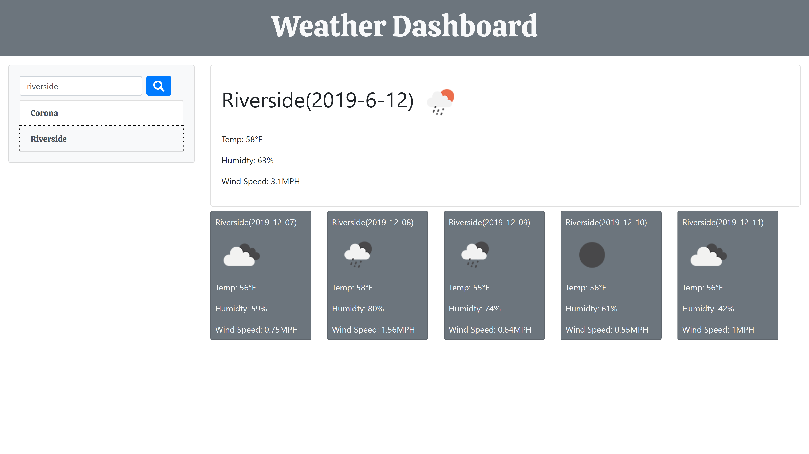

# WeatherApp
Here is a project that implements what i have learned about ajax calls and manipulating data received.
This weather app allow user to view weather of requested city and a 5 day forecast.
The requested city is then stored in session storage so use can view history of request.
# Screenshot

